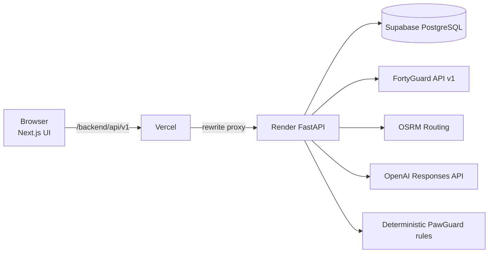
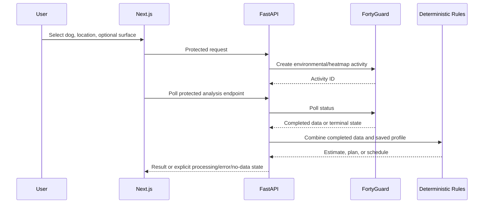

# PawGuard

> **Walk smart. Stay cool.** PawGuard combines FortyGuard environmental analysis with each dog’s saved profile to provide explainable, heat-aware walk planning.

[](frontend/)
[](backend/)
[](backend/alembic/)
[](https://fortyguard.com/)

## Live Demo

[Open PawGuard](https://paw-guard-fortyguard-y26.vercel.app/)

## Demo Video

[Watch the demo](https://www.youtube.com/watch?v=Hbe9aCMw-BM)

## Temporary Judge Credentials

Email: `test@pawguard.com`<br>
Password: `Paw13579`

<svg width="400" height="110" xmlns="http://www.w3.org/2000/svg">
  <rect width="100%" height="100%" fill="#FFFD01" rx="8"/>
  <text x="15" y="30" font-family="sans-serif" font-size="16" font-weight="bold" fill="#000000">Temporary Judge Credentials</text>
  <text x="15" y="65" font-family="sans-serif" font-size="14" fill="#000000">Email: test@pawguard.com</text>
  <text x="15" y="90" font-family="sans-serif" font-size="14" fill="#000000">Password: Paw13579</text>
</svg>

## Overview

PawGuard is a responsive dog heat-safety and smart walk-planning application. It combines protected multi-dog profiles, real completed FortyGuard activities, deterministic safety rules, route geometry, saved history, and a grounded AI Safety Assistant. The product favors transparent estimates and clear unavailable-data states over false certainty.

## Problem & Solution

Heat exposure is not one-size-fits-all: age, size, coat, anatomy, activity, fitness, location, timing, and surface can all matter. PawGuard turns those inputs into a practical workflow—retrieve real environmental data server-side, combine it with a chosen dog through configurable deterministic rules, and present a cautious recommendation with its main reasons.

## Core Features

| Area | Capability |
| --- | --- |
| Accounts & profiles | Sign up/login/logout, HTTP-only sessions, owner-scoped multi-dog CRUD. |
| Risk estimates | Explainable 0–100 heat estimate plus estimated surface risk for asphalt, concrete, grass, sand, and soil/dirt. |
| Planning | Best Walk Time, duration recommendation, Walk Match, and a non-overlapping Daily Scheduler. |
| Maps & routes | FortyGuard GeoJSON Heat Map and OSRM-backed heat-aware walking-route comparison. |
| Walk support | Active Walk timer, reminders, saved sessions, History, Safety Center, and an emergency-vet map search. |
| Assistant | Authenticated OpenAI assistant grounded in PawGuard’s structured outputs, with profile-only fallback when live data is unavailable. |
| Demo seed | Opt-in, idempotent seed for one designated account’s five dogs and saved sample history. |

## FortyGuard Integration

FortyGuard Temperature API v1 is called **only by FastAPI**. The browser never receives its API key.

- Backend requests environmental parameters and heatmaps.
- Async activities follow create → activity ID → protected status polling → completed/failed/no-data state.
- Completed forecast heatmap intervals power Walk Planner and Daily Scheduler; missing intervals are never invented.
- Completed GeoJSON tiles/statistics power the Heat Map and relative route heat-exposure comparison.
- Current-condition workflows support heat risk, surface risk, Walk Match, and Active Walk.

Provider delays, unsupported requests, quotas, failures, and no-data outcomes are rendered explicitly. PawGuard does not claim exact pavement or street-level temperatures.

## Tech Stack

| Layer | Technologies |
| --- | --- |
| Frontend | Next.js App Router, React, TypeScript, Tailwind CSS, PostCSS |
| Backend | Python, FastAPI, Pydantic, Uvicorn, HTTPX |
| Data | PostgreSQL, SQLAlchemy, Psycopg 3, Alembic |
| Authentication | Argon2 (`pwdlib`), HS256 signed JWT, HTTP-only cookie |
| Integrations | FortyGuard Temperature API v1, OSRM foot routing, OpenAI Responses API |
| Hosting | Vercel frontend/proxy, Render API service, Supabase PostgreSQL |
| Quality | Pytest, Vitest, TypeScript validation, Next.js production build |

## Architecture



Production `NEXT_PUBLIC_API_URL` is `/backend`. Vercel rewrites `/backend/:path*` to Render, while Render owns provider credentials, database access, authentication, and risk-rule execution.

## Data Pipeline



## Getting Started

### Prerequisites

- Node.js 20.9+
- Python 3.11+
- pnpm
- Docker Desktop for the included PostgreSQL service, or another PostgreSQL database

### Environment & Database

```bash
cp .env.example .env
docker compose up -d db
```

PowerShell: `Copy-Item .env.example .env`

| Variable | Purpose |
| --- | --- |
| `DATABASE_URL` | Server-side PostgreSQL connection string. |
| `SECRET_KEY` | JWT signing secret. |
| `CORS_ORIGINS` | Comma-separated allowed browser origins. |
| `COOKIE_SECURE` | `false` locally; `true` over production HTTPS. |
| `FORTYGUARD_API_KEY` | Server-only FortyGuard credential. |
| `OPENAI_API_KEY` | Server-only assistant credential. |
| `NEXT_PUBLIC_API_URL` | `http://localhost:8000` locally; `/backend` on Vercel. |

The checked-in template contains placeholders only. Never commit `.env`, API keys, database URLs, or `SECRET_KEY` values.

### Backend

```bash
cd backend
python -m venv .venv
# PowerShell
.\.venv\Scripts\Activate.ps1
pip install -r requirements.txt
alembic upgrade head
uvicorn app.main:app --reload --host 0.0.0.0 --port 8000
```

- Health: [http://localhost:8000/api/v1/health/](http://localhost:8000/api/v1/health/)
- Docs: [http://localhost:8000/docs](http://localhost:8000/docs)

### Frontend

```bash
cd frontend
pnpm install
pnpm dev
```

Open [http://localhost:3000](http://localhost:3000).

### Optional Demo Seed

The seed command is never run during web-app startup. It creates missing data only for `DEMO_ACCOUNT_EMAIL`, does not call FortyGuard, and does not create live conditions.

```bash
cd backend
DEMO_SEED_ENABLED=true \
DEMO_ACCOUNT_EMAIL=demo@example.com \
DEMO_ACCOUNT_PASSWORD=choose-a-strong-password \
python -m app.db.seed_demo
```

It creates Max, Bruno, Luna, Bella, and Coco plus six saved historical sample walks. Re-running it does not create duplicates.

## Deployment Architecture

| Service | Role |
| --- | --- |
| Vercel | Next.js frontend and `/backend/*` rewrite from `frontend/vercel.json`. |
| Render | FastAPI from `backend`; startup runs `alembic upgrade head` before Uvicorn. |
| Supabase | Production PostgreSQL through Render’s `DATABASE_URL`. |

Configure Vercel with `NEXT_PUBLIC_API_URL=/backend`. Configure Render with `DATABASE_URL`, `SECRET_KEY`, `FORTYGUARD_API_KEY`, `OPENAI_API_KEY`, `COOKIE_SECURE=true`, and the Vercel production URL in `CORS_ORIGINS`.

## Security & Privacy

- Passwords use Argon2; signed sessions are stored in HTTP-only cookies.
- Protected routes use owner-scoped queries for dogs, walks, and analyses.
- Provider keys, database credentials, and signing secrets remain server-side.
- The assistant receives minimized structured context—not password hashes, API keys, account email, dog notes, or raw provider payloads.

## Impact

PawGuard makes heat-aware dog walking more actionable by joining environmental analysis with an individual dog, selected surface, available time, and route. It prioritizes explainability, privacy, and honest uncertainty.

## Limitations & Safety

PawGuard is a planning and awareness tool—not veterinary diagnosis, medical advice, emergency dispatch, or a guarantee of safety. Surface risk is an estimate; FortyGuard does not provide exact pavement temperature. Live features depend on provider coverage and completed activities. Stop activity and seek veterinary help promptly for concerning symptoms.

## Project Structure

```text
PawGuard/
├── frontend/                 # Next.js pages, components, middleware, tests
├── backend/
│   ├── app/api/routes/       # FastAPI endpoints
│   ├── app/services/         # FortyGuard, risk, route, assistant services
│   ├── app/models/           # User, Dog, Walk models
│   ├── app/core/             # Settings, security, deterministic rules
│   ├── app/db/seed_demo.py   # Opt-in demo seeder
│   ├── alembic/              # Migrations
│   └── tests/                # Backend tests
├── docker-compose.yml        # Local PostgreSQL 16
└── render.yaml               # Render configuration
```

## Testing

```bash
# backend/
pytest -q
alembic upgrade head --sql

# frontend/
pnpm test
pnpm exec tsc --noEmit
pnpm build
```

Regression coverage includes deterministic heat/surface rules, forecasts and async analyses, Walk Match, scheduling, Active Walk, route heat, assistant behavior, API URL/proxy helpers, and deployment configuration.
